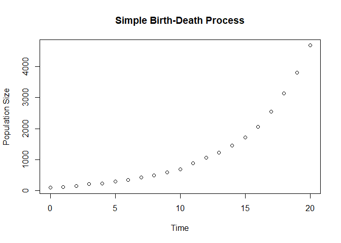
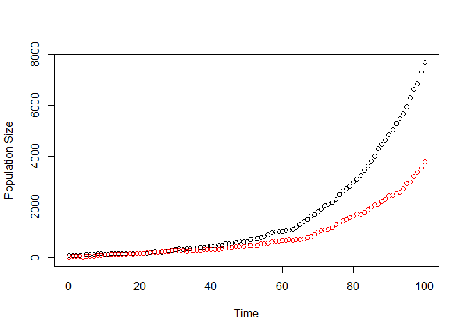
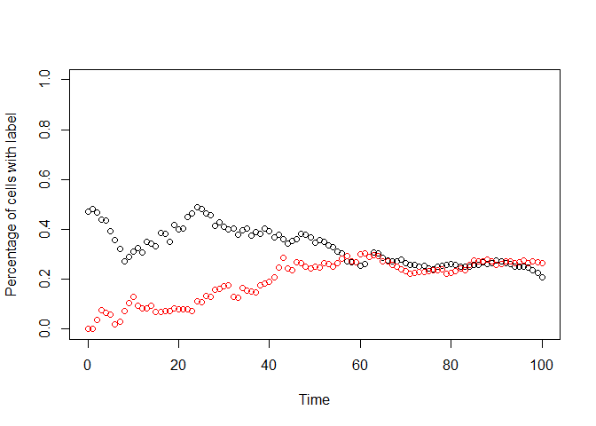

<!-- README.md is generated from README.Rmd. Please edit that file -->
DIFFpop
=======

DIFFpop is an R package to simulate cell labeling experiments performed on differentiation hierarchies.

Dependencies
------------

-   [GNU Scientific Library](https://www.gnu.org/software/gsl/)
    -   (OSX) `brew install gsl` with Homebrew or from [here](http://ftpmirror.gnu.org/gsl/).
    -   (Windows) download and extract the file [local\#\#\#.zip](http://www.stats.ox.ac.uk/pub/Rtools/goodies/multilib/) and create an environmental variable LIB\_GSL to add the directory (see notes about Windows installation below for more details).
    -   (Linux) install libgsl0-dev and gsl-bin.
-   [Rtools](https://cran.r-project.org/bin/windows/Rtools/) (*Windows only*)
-   [devtools](https://github.com/hadley/devtools)
-   [dplyr](https://cran.r-project.org/web/packages/dplyr/index.html)
    -   Issues arise with installation of recursive dependencies using install\_github. Installing this R package first solves this issue.

### Important Notes about Windows installation

Rtools contains the necessary resources to compile C++ files when installing packages in R. GSL is also required which can be downloaded from [here](http://www.stats.ox.ac.uk/pub/Rtools/goodies/multilib/local323.zip). After downloading, unzip to your R directory. Depending on if your computer is 32 or 64-bit, move the library files from **local\#\#\#/lib/i386** (32-bit) or **local\#\#\#/lib/x64** (64-bit) to **local\#\#\#/lib**.

To set the environmental variable LIB\_GSL on a Windows 7/10 computer, go to "Advanced system settings" in *Control Panel &gt; System and Security &gt; System* and click *Environmental Variables*. Create a new system variable with

-   Variable Name: **LIB\_GSL**
-   Variable Value: **"C:/path/to/local323"** (include quotes)

Recommended R packages
----------------------

The following R packages are required for certain functions.

-   igraph
-   ggplot2
-   R.utils

Installation
============

To install in R, type:

``` r
install.packages("devtools")
devtools::install_git("https://github.com/ferlicjl/diffpop.git")
```

Installing the library should compile all necessary functions so that DIFFpop can be run as an R function.

Uses
====

DIFFpop is an R package that uses C++ to simulate the maturation process of cells through user-defined differentiation hierarchies according to user-defined event rates. The software is capable of simulating hierarchies in two manners: using a branching process with growing populations and using a modified Moran process with fixed population sizes.

For increasing population simulations, the system will grow or decline as a branching process according to the exact rates specified by the user. If at any point any population becomes extinct, the simulation halts. A branching process is a stochastic process used to model the growth and composition of reproducing populations. Assumptions made in branching processes are individuals live for a random amount of time before some event. Here, we will only consider events that are analogous to cellular differentiation events, i.e. mitosis, differentiation, and apoptosis. Individuals of the same type are independent and identically distributed. Simulation of the branching process is an application of the direct Gillespie Stochastic Simulation Algorithm.

Simulations with fixed population sizes are carried out using a modified Moran Process. A traditional Moran Process consist of a population of cells, each belonging to a certain class, and having an individual fitness. In each time step, a random cell is selected for division and a random cell is selected for apotosis, ensuring that the population size remains constant. To introduce selection, cells with higher fitness values are more likely to be selected for division. To modify the Moran Process and place it in the setting of differentiation, we have included additional cellular events. By continuing to couple events together, we are able to maintain a constant population size.

Applications
============

Binary Cell Labeling
--------------------

DIFFpop is capable of tracking the uptake and progression of a binary label throughout a differentiation hierarchy. In experimental settings, these are often fluorescent labels that allow the researchers to sort samples into cell types and then quantify proportion of cells that express the label.

Simulating a binary labeling scheme in DIFFpop can be achieved in two ways. In the first, the user manually enters the number of initial cells that belong to the unlabeled and labeled populations. In the second, the user specifies with what probability a cell will gain the label upon simulation initiation. The proportion of labeled cells can be tracked over time in the label and census output file.

As an example of applying DIFFpop to this type of data, we have included a vignette replicating the results from introducing a yellow fluorescent protein (YFP) reporter into the hematopoietic cells of the bone marrow (Busch et al., Nature 2015). After validating that our stochastic simulations closely match the results from the in-vivo experiments, we could further investigate the system using DIFFpop, including inferring hematopoietic clonal dynamics from the system if the investigators introduced unique barcode labeling.

Confetti-style Labeling
-----------------------

A confetti-style labeling scheme is one in which one particular label from amongst a series of possible labels is expressed through random segregration and reintegration into the host cells genome. As an example system, 4 possible colored reports, labeled green, blue, yellow, and red, are added side-by-side in the host cell's genome. Upon induction by CRE recombinase, these label sections are random spliced out of the genome and reintegrated, with ultimately only one label color being expressed. This same label is expressed in all daughter cells and can be traced as cells replicate and differentiate.

Simulating a confetti-style labeling scheme can be achieved in DIFFpop by simply specifying the initial number of cells to express each particular label. The census files can then be analyzed upon simulation completion to track the changes in label expression throughout the system over time.

As an example of this type of experimental procedure, we point the reader to a confetti-style labeling scheme implemented in the hematopoietic system of mice (Ganuza et al., Nat Cell Biol. 2017). Such a labeling experiment could be easily simulated using DIFFpop assuming the proper population sizes and transition rates were known.

Unique Cell Barcoding
---------------------

In addition to simulating fluorescent cell labels, DIFFpop can also be used in combination with unique cell barcoding experiments. Unique cell labeling can be achieved by introducing a mobile transcodon into the genome. Upon induction of labeling with tamoxifen, this transcodon is spliced from the genome, and randomly reintegrated at some point in the host genome. Assuming the probability that the transcodon randomly integrating into the same location in two cells is negligible, each cell now contains the transcodon in a unique genomic position. The transcodon in this location will then be passed to all offspring cells and be maintained through replication and differentiation events. At the end of an experiment, cell populations can be sorted and then sequenced for the presence or absence of these barcodes. Alternatively, a sample of cells can be sent off for single cell sequencing, allowing for not only the presence or absence of a particular barcode, but also an estimate of the size of a particular barcode-defined clone.

Simulating unique cell barcoding in DIFFpop can easily be achieved by simply specifying the proportion of cells to be successfully labeling upon system initialization. The census files can then be analyzed upon simulation completion to track the barcode frequencies in the system over time. One can even simulate a single cell barcoding experiment by randomly sampling from the barcode population.

As an example of a unique barcoding population, we point the reader to an experimental procedure in which cells of the hematopoietic system are labeled in-vivo and analyzed in native hematopoiesis, not requiring the use of cell transplantation (Rodriguez-Fraticelli et al., Nature 2018).

Using DIFFpop in R
==================

The first step to utilize DIFFpop for simulation of a differentiaton hierarchy is to specify the populations of the hierarchy. Populations of cells are created using functions that correspond to a specific software class, i.e. GrowingPop, FixedPop, or DiffTriangle. Users must give each population a unique name as well as an initial population size. Optionally, users may specify an initial cell barcoding frequency, which represents the proportion of initial cells that receive a unique barcode. If this parameter is not set, no unique barcodes will be created for the population.

The next step is to specify the transitions between populations. For that purpose, the addEdge function is used, along with the correct parameters: the initiating population, the receiving population, event type as a string (either "alpha", "beta", "gamma1", "gamma2", "delta", "zeta", or "mu"), and event rate. For events involving only one population ("alpha", "delta", or "mu"), users set that population as both the initiating and receiving population.

The last specification step is to specify which population is the root of the differentiation hierarchy, that is, which population is the furthest upstream, using the setRoot function in R.

The simulateTree function is then used to initiate the simulation.

Simulation parameters
---------------------

Table 4 describes the parameters of the simulation.

<table>
<caption>Description of simulation parameters</caption>
<colgroup>
<col width="13%" />
<col width="17%" />
<col width="69%" />
</colgroup>
<thead>
<tr class="header">
<th>Parameter</th>
<th>Variable Type</th>
<th>Description</th>
</tr>
</thead>
<tbody>
<tr class="odd">
<td>tree</td>
<td>DiffTree</td>
<td>specifies which hierarchy to simulate</td>
</tr>
<tr class="even">
<td>fixed</td>
<td>boolean</td>
<td>TRUE if simulating using FixedPops and DiffTriangles, FALSE if simulating using GrowingPops</td>
</tr>
<tr class="odd">
<td>time</td>
<td>integer</td>
<td>number of time units to simulate</td>
</tr>
<tr class="even">
<td>census</td>
<td>integer</td>
<td>how often to output full census of populations</td>
</tr>
<tr class="odd">
<td>indir</td>
<td>string</td>
<td>directory location of input files</td>
</tr>
<tr class="even">
<td>outdir</td>
<td>string</td>
<td>directory location for output files</td>
</tr>
<tr class="odd">
<td>seed</td>
<td>numeric</td>
<td>optional seed for the random number generator</td>
</tr>
</tbody>
</table>

Observations are made and output files updated at every integer time unit through *n**O**b**s*. In addition, full outputs of the cell states in each population are made every *c**e**n**s**u**s* time unit(s). The *i**n**d**i**r* directory informs the C++ backend where the input files for the differentiation hierarchy are located and *o**u**t**d**i**r* specifies a particular directory in which to place all output files. Optionally, the user can specify a numeric *s**e**e**d* for the GSL random number generator used throughout the simulation.

Birth-Death Example
-------------------

Towards learning how to utilize DIFFpop to simulate cellular differentiation, we present the following birth-death process. Using this simple example as a starting-off point, we will then show how by the addition of relatively few lines, this model can be modified and expanded.

The following script will create the example.

``` r
library(diffpop)

# Create an empty DiffTree object
tree1 = DiffTree()

# Create a population "pop1" with 100 unlabeled cells
GrowingPop(tree = tree1, name = "pop1", size = 100, label = 0.0)

# Add cell birth event to pop1
addEdge(tree = tree1, parent = "pop1", child = "pop1", type = "alpha", rate = 0.5)
# Add cell death event to pop1
addEdge(tree = tree1, parent = "pop1", child = "pop1", type = "delta", rate = 0.3)

# Set the root of tree1 to "pop1"
setRoot(tree = tree1, popName = "pop1")

# Simulate tree1 for 10 time units writing results to ./output/
simulateTree(tree = tree1, fixed = FALSE, time = 20, 
             indir = "./input/", outdir = "./output/")
```

After installing DIFFpop using the steps outlined above, the library must first be loaded into the current R session. In order to begin creating a differentiation hierarchy, we must create an empty DiffTree object we wil call "tree1". We then begin by creating a single population named "pop1", and initializing it to contain 100 unlabeled cells, and add it to the tree. Because we want to model a population whose size will fluctuate over time, we will use a GrowingPop to model this population.

We will then add transitions to this population. We will start by adding a self-renewal event, which will occur at a rate of 0.5 events per cell per time unit. We will also add the death event, which will occur at a rate of 0.3 events per cell per time unit.

The last remaining steps are to set "pop1" as the root of the differentiation tree and start our simulation. We will simulate this tree for 20 units of time, writing all of the inputs to the input folder and all output files to the output folder. We will also set the simulation parameter fixed to FALSE, notifying DIFFpop we are modeling the system using GrowingPops.

Before expanding our basic process, let us take a look at some of the output files from this simulation. Each simulation is given a unique file prefix. For example, the output files from the last run were all prefixed with "out\_11-11-2018-202313\_54045", letting us know the simulation was initiated at 8:23 PM on November 11, 2018. Because we had completely unlabelled cells and did not allow for mutation, the only system statistics of interest are the population sizes, which are output to the "out\_11-11-2018-202313\_54045\_pop.csv" file each time unit. Let's plot the population size of "pop1" over the course of the simulation.

``` r
library(ggplot2)
#> Warning: package 'ggplot2' was built under R version 3.5.1

popfiles = list.files("./output/", pattern="^out.*_pop.csv$", full.names=T)

# Read in population sizes file
pop = read.csv(popfiles[length(popfiles)])

# Plot the population size of "pop1" vs. simulation
plot(pop$time, pop$pop1, xlab = "Time", ylab = "Population Size", 
      main = "Simple Birth-Death Process")
```



Extending the Birth-Death Example
---------------------------------

In our next example, let us look at exploring some other features of DIFFpop beyond a simple birth-death process by labeling 50% of cells in "pop1", adding an additional population "pop2", adding differentiation from "pop1" to "pop2", and allowing for mutations to occur in "pop1". We can store this updated tree as "tree2". Whenever a mutation occurs, we will introduce a new fitness change to be drawn from a standard normal distribution. Below is the entire script needed to simulate this model.

``` r
library(diffpop)

# Create an empty DiffTree object
tree2 = DiffTree()

# Create two populations, labeling on average 50% of cells in pop1
GrowingPop(tree = tree2, name = "pop1", size = 100, label = 0.50)
GrowingPop(tree = tree2, name = "pop2", size = 50, label = 0.0)

# Add cell birth/death events to pop1
addEdge(tree = tree2, parent = "pop1", child = "pop1", type = "alpha", rate = 0.4)
addEdge(tree = tree2, parent = "pop1", child = "pop1", type = "delta", rate = 0.3)

# Add cell birth/death event to pop2
addEdge(tree = tree2, parent = "pop2", child = "pop2", type = "alpha", rate = 0.35)
addEdge(tree = tree2, parent = "pop2", child = "pop2", type = "delta", rate = 0.4)

# Add differentiation from pop1 to pop2
addEdge(tree = tree2, parent = "pop1", child = "pop2", type = "gamma1", rate = 0.05)

# Add mutation in pop1, occurs during each mitosis event with probability 1e-4
addEdge(tree = tree2, parent = "pop1", child = "pop1", type = "mu", rate = 1e-4)

# Set fitness change distribution when a new mutant arises
setFitnessDistribution(tree = tree2, 
                       distribution = "normal",
                       alpha_fitness = 0, 
                       beta_fitness = 1,
                       pass_prob = 0, 
                       upper_fitness = NA, 
                       lower_fitness = 0)

# Set the root of tree1 to "pop1"
setRoot(tree = tree2, popName = "pop1")

# Simulate tree1 for 50 time units writing results to ./output2/
simulateTree(tree = tree2, fixed = FALSE, time = 100, 
             indir = "./input2/",  outdir = "./output2/")
```

Let us explore some of the output files from this simulation run. First, let us once again start with a plot of the population sizes over time.

``` r
popfiles = list.files("./output2/", pattern="^out.*_pop.csv$", full.names=T)

# Read in population sizes file
pop = read.csv(popfiles[length(popfiles)])

# Plot the population size of "pop1" vs. simulation time
plot(pop$time, pop$pop1, col = "black", 
     xlab = "Time", ylab = "Population Size", ylim = c(0, max(pop)))
points(pop$time, pop$pop2, col = "red")
```



We can also look at how quickly the label, which was only initialized in pop1, was taken up in pop2. To do this, we will plot from the label output file, which shows the percentage of cells in the population that contain the label.

``` r
# Read in label file
lblfiles = list.files("./output2/", pattern="^out.*_label.csv$", full.names=T)

# Read in label file
label = read.csv(lblfiles[length(lblfiles)])

# Plot the label percentage  vs. simulation time
plot(label$time, label$pop1, col = "black", 
     xlab = "Time", ylab = "Percentage of cells with label", ylim = c(0, 1))
points(label$time, label$pop2, col = "red")
```



We can view the mutation output file to see which mutations occurred, in which populations they occurred, and the resulting fitnesses of those clone.

``` r
# Read in label file
mutfiles = list.files("./output2/", pattern="^out.*_mut.csv$", full.names=T)

# Read in population sizes file
mut = read.csv(mutfiles[length(mutfiles)])

print(head(mut))
#>   mutant    time population fitness
#> 1      1 32.1992       pop1 0.00000
#> 2      2 64.7184       pop1 2.39859
#> 3      3 67.4419       pop1 0.00000
#> 4      4 68.8658       pop1 0.00000
#> 5      5 71.7886       pop1 0.00000
#> 6      6 80.1769       pop1 2.18164
```

For more detailed examples, please set the vignettes.

Software Design and Class Structures
====================================

GrowingPop
----------

A GrowingPop is the base class used to designate the various cell types throughout a differentiation tree. A GrowingPop contains a list of cell states, functions to enact cellular events on those cell states, and event rates at which to perform those functions. The hierarchical structure is maintained by pointers to upstream and downstream CellPopulations.

FixedPop
--------

A FixedPop is a class derived from a GrowingPop. In order to maintain a constant population size, cellular events are coupled together; i.e. a mitosis event generating an additional cell is immediately coupled with a differentiation or death event. Similarly, if the number of cells in the FixedPop population increases by one from upstream differentiation, a differentiation or death event of its own is immediately enacted to maintain the population level.

DiffTriangle
------------

A DiffTriangle cell type is used to represent the downstream fully differentiated cells. Cells are arranged in a triangle formation. Cells enter the population on the highest level of the triangle, experiencing further differentiation and division to progress down the triangle. When a new cell enters the DiffTriangle population, it causes an already existing cell on the highest level to divide and further differentiate to the next level of the triangle. Those two cells each displace a pre-existing cell, causing them to divide and differentiate (thus generating four newly displaced cells), which in turn displace cells that further displace cells until reaching the lowest level of the triangle. A displaced cell from the last row of the triangle can either be passed on to an offspring cell type (if there are further cell types in the hierarchy), or die out. Importantly, DiffTriangle structures will not initiate any cellular events of their own, as differentiation waves throughout a triangle is only initiated when receiving a new cell from an upstream population.

The population size of a DiffTriangle is specified by two parameters; the first, *z* is the number of cell divisions until full maturation or the number of levels in the triangle. The second is called the *mfactor*, which is the number of triangles to be stacked side-by-side. If *mfactor* is greater than 1, then a cell entering the DiffTriangle population simply chooses at random which specific triangle to enter.

DiffTree
--------

A DiffTree contains pointers to all populations throughout the differentiation hierarchy. From the DiffTree object, all cell types in the hierarchy can be accessed in either a breadth-first or depth-first manner. Hierarchy-wide functions, such as simulating the hierarchy and recording output, are initiated by calling functions of the DiffTree.

<table style="width:89%;">
<colgroup>
<col width="15%" />
<col width="22%" />
<col width="51%" />
</colgroup>
<thead>
<tr class="header">
<th>Class Type</th>
<th>Population Size</th>
<th>Use</th>
</tr>
</thead>
<tbody>
<tr class="odd">
<td>GrowingPop</td>
<td>Dynamic</td>
<td>dynamically sized population with exponential event waiting times</td>
</tr>
<tr class="even">
<td>FixedPop</td>
<td>Constant</td>
<td>constant size homogenous population</td>
</tr>
<tr class="odd">
<td>DiffTriangle</td>
<td>Constant</td>
<td>constant size population with <em>z</em> levels of maturity</td>
</tr>
</tbody>
</table>

NodeList Data Structure
-----------------------

The cells of each population are maintained by a NodeList. A NodeList is a doubly-linked list of Nodes. Each Node keeps track of a particular cell state, defined by the combination of a barcode, mutation status, and fitness value, as well as a count of how many cells belong to that particular state. In addition, DiffTriangle Nodes also contain data to record which triangle and at which level a cell resides. Mutation status is a string listing which mutations have occurred in that state. Information about particular mutations can be found in the mutation information file. The NodeList keeps track of the total number of cells in the list and overall fitness for the population. Methods exist to insert or remove cells from the list, maintaining a left-balanced list by cell count -- that is, cell states with higher cell counts are found to the left of the list. This approach allows for more efficient indexing by cell count, particularly as diversity in the compartment decreases or dominant clones arise.

Event Types and Parameters
==========================

Cellular events in DIFFpop are enacted according to their accompanying parameter rates, in units of number of events per cell per time unit.

<table>
<colgroup>
<col width="13%" />
<col width="17%" />
<col width="69%" />
</colgroup>
<thead>
<tr class="header">
<th>Parameter</th>
<th>Variable Type</th>
<th>Description</th>
</tr>
</thead>
<tbody>
<tr class="odd">
<td><span class="math inline"><em>α</em></span> (alpha)</td>
<td>double</td>
<td>mitotic self-renewal rate</td>
</tr>
<tr class="even">
<td><span class="math inline"><em>β</em></span> (beta)</td>
<td>double</td>
<td>asymmetric differentiation rate to downstream cell type</td>
</tr>
<tr class="odd">
<td><span class="math inline"><em>γ</em><sub>1</sub></span> (gamma1)</td>
<td>double</td>
<td>mitosis-independent (one-to-one) differentiation rate to downstream cell type</td>
</tr>
<tr class="even">
<td><span class="math inline"><em>γ</em><sub>2</sub></span> (gamma2)</td>
<td>double</td>
<td>mitosis-dependent (one-to-two) differentiation rate to downstream cell type</td>
</tr>
<tr class="odd">
<td><span class="math inline"><em>ζ</em></span> (zeta)</td>
<td>double</td>
<td>de-differentiation rate to upstream cell type</td>
</tr>
<tr class="even">
<td><span class="math inline"><em>δ</em></span> (delta)</td>
<td>double</td>
<td>apoptosis rate</td>
</tr>
<tr class="odd">
<td><span class="math inline"><em>μ</em></span> (mu)</td>
<td>double</td>
<td>probability of mutation per mitotic event</td>
</tr>
</tbody>
</table>

\*Note Population specific parameters are specified using subscripts, i.e.
*α*<sub>(*L**T* − *H**S**C*)</sub>
 is the mitotic self renewal rate for the LT-HSC population and *γ*<sub>1(*L**T* − *H**S**C*, *S**T* − *H**S**C*)</sub> is the one-to-one differentiation rate from the LT-HSC population to the ST-HSC population.


Events can be split into three categories based on how they affect the population size of the compartment:

-   “i-1” events result in a one-cell deficit
    -   differentiation (*γ*<sub>1</sub>/*γ*<sub>2</sub>)
    -   de-differentiation (*ζ*)
    -   apoptosis (*δ*)
-   “i” events maintain the population size
    -   asymmetric differentiation (*β*)
-   “i+1” events result in a one-cell surplus
    -   mitosis (*α*)

Mutations in DIFFpop occur only during mitosis events. Each mitosis event results in a new mutation with probability *μ*. Thus, in the MPP population, the rate of mitosis events resulting in a new mutation is *α*<sub>(*M**P**P*)</sub>*μ*<sub>(*M**P**P*)</sub> and the rate of mitosis events resulting in no mutation is *α*<sub>(*M**P**P*)</sub>(1 − *μ*<sub>(*M**P**P*)</sub>). Mutations accumulate according to the infinite allele assumption, that is, a new mutation leads to a new allele that has yet to be seen in the population.

In the FixedPop setting, all de-differentiation events will result in an apoptosis event in the receiving population. This is necessary to avoid circular equations when calculating adjustments to net proliferation in order to maintain a constant population size.

Simulation Overview
===================

After the tree structure has been specified in R, the task of simulating is handed off to a C++ backend. Before events can be enacted, the tree structure and other user-specified parameters must be read from the input files.

Initializing a Simulation
-------------------------

1.  Read tree structure from input files
2.  Initialize populations
3.  Write parameter information
4.  Output tree structure to user

Simulation for branching process via Gillespie Algorithm
--------------------------------------------------------

1.  Initiate simulation at time 0
2.  Generate the time to the next event
    1.  Iterate through population hierarchy, collecting total event rate from each population
    2.  Generate a time from exponential distribution, parameter equal to sum of event rates from all populations
3.  Make observations
4.  Update state
    1.  Choose which population enacts event
    2.  Enact single event on that population
5.  If simulation time remains, repeat from step 2

Simulation for multitype Moran process via Tau Leaping
------------------------------------------------------

1.  For each time unit:
    1.  Iterate through tree in breadth-first manner
    2.  For each population:
        1.  Get total number of i-1 and i events \[*γ*<sub>1</sub>, *γ*<sub>2</sub>, *δ*, *ζ*, and *β*\] = *j*
        2.  Enact *j* events choosing which event according to the event rates. If event results in a one-cell deficit, enact a mitosis \[*α*\] event

Input Files
-----------

1.  Population information (node.csv)
    -   Population name, software class of population, root, initial barcode percentage, DiffTriangle height, DiffTriangle mfactor
2.  Event information (edges.csv)
    -   "from" population, "to" population, event type, event rate
3.  Fitness change distribution (fitnessdist.txt)
    -   Parameters of user-defined fitness distribution. Blank file means the default parameters will be used
4.  Population order (bfs.txt)
    -   Populations in the tree listed in breadth-first order. Used to order populations for output files

Output Files
------------

Each run of the simulation will be given a unique file prefix, consisting of the date and time when the simulation initiated, followed by a random integer.

1.  Population size (*prefix*\_pop.csv)
    -   Size of each population at each observation time
2.  Diversity indices (*prefix*\_diversity.csv)
    -   Shannon diversity and Simpson diversity are calculated at each observation time for each population along with the total number of barcode species present in each population at each obervation time
3.  Fraction of labelled cells (*prefix*\_label.csv)
    -   Fraction of cells that contain unique barcode/label at each observation time for each population
4.  Event rates (*prefix*\_events.csv)
    -   Number of events that occurred between each observation time
5.  Mutation summary (*prefix*\_mut.csv)
    -   Time of mutation, compartment location, and new fitness for each new clone that arises
6.  Parameter summary (*prefix*\_params.csv)
    -   Summary of parameters given by user, as well as recalculated event rates if using FixedPops
7.  Census files (*prefix*\_*population*\_census.csv)
    -   Complete census of cell states for each census time, including barcode, mutation history, fitness, and cell count
8.  Done file (*prefix*.done)
    -   File is created when simulation is complete. Alerts user that they can begin moving or manipulating other simulation results files

Maintaining a constant population size
======================================

In order to maintain a constant population size, a relationship must exist between the event rates of the compartment. Specifically, those event rates that result in an excess of cells in the compartment \[“i+1” rates\] must be balanced with those event rates that result in a deficit of cells \[“i-1” rates\].

Let *α*<sub>(*x*)</sub> denote the mitotic self-renewal (*α*) rate of population *x*. Let *γ*<sub>1(*x*, *y*)</sub> denote the one-to-one differentiation (*γ*<sub>1</sub>) rate from population *x* to population *y*.Let *γ*<sub>2(*x*, *y*)</sub> denote the one-to-two differentiation (*γ*<sub>2</sub>) rate from population *x* to population *y*.Let *β*<sub>(*x*, *y*)</sub> denote the asymmetric differentiation (*β*) rate from population *x* to population *y*.Let *ζ*<sub>(*x*, *y*)</sub> denote the one-to-one de-differentiation (*ζ*) rate from population *x* to population *y*.Let *δ*<sub>(*x*)</sub> denote the cell death (*δ*) rate of population *x*.Let *n*<sub>(*x*)</sub> be the size of population *x*.

Then, for any compartment *A*,

$$\\\[
\\begin{align}
n\_{(A)}\\alpha\_{(A)} &+ \\sum\_{\\text{pop }i \\neq A}n\_{(i)}\\left( \\gamma\_{1(i,A)} + 2\\gamma\_{2(i,A)} + \\beta\_{(i,A)} + \\zeta\_{(i,A)}\\right) = n\_{(A)}\\left\[ \\delta\_{(A)} + \\sum\_{\\text{pop }i\\neq A}\\left( \\gamma\_{1(A,i)} +\\gamma\_{2(A,i)} + \\zeta\_{(A,i)}\\right) \\right\] \\\\
\\implies \\\\
\\delta\_{(A)} &= \\frac{n\_{(A)}\\left\[\\alpha\_{(A)}- \\sum\_{\\text{pop }i\\neq A}\\left( \\gamma\_{1(A,i)} + \\gamma\_{2(A,i)} + \\zeta\_{(A,i)} \\right)\\right\] + \\sum\_{\\text{pop }i \\neq A}n\_{(i)}\\left( \\gamma\_{1(i,A)} + 2\\gamma\_{2(i,A)} + \\beta\_{(i,A)} + \\zeta\_{(i,A)}\\right)}{n\_{(A)}}
\\end{align}
\\\]$$

For the population size to remain constant, this first line of the equation must hold. That is, events that increase the population size (self-renewal and influx from other populations) must be balanced by events that decrease the population (cell death and differentiation). In the modified Moran Process, we force this to hold by automatically calculating delta for each population. If this calculated delta value is positive, we simply set the effective death rate equal to this value. If this calculated delta value is negative, we increase the alpha rate of the population by this value.

Fitness Distribution
====================

Throughout the differentiation hierarchy, whenever a new clone arises due to mutation, a change in fitness can be drawn from a random distribution. The parameters of that distribution can be specified by the user in R.

<table style="width:90%;">
<colgroup>
<col width="20%" />
<col width="6%" />
<col width="62%" />
</colgroup>
<thead>
<tr class="header">
<th>Parameter Name</th>
<th>Type</th>
<th>Description</th>
</tr>
</thead>
<tbody>
<tr class="odd">
<td>fitness_distribution</td>
<td>string</td>
<td>&quot;doubleexp&quot;, &quot;normal&quot;, &quot;uniform&quot;</td>
</tr>
<tr class="even">
<td>alpha_fitness</td>
<td>double</td>
<td>alpha parameter for fitness distribution</td>
</tr>
<tr class="odd">
<td>beta_fitness</td>
<td>double</td>
<td>beta parameter for fitness distribution</td>
</tr>
<tr class="even">
<td>pass_prob</td>
<td>boolean</td>
<td>probability that mutation does not result in a fitness change</td>
</tr>
<tr class="odd">
<td>upper_fitness</td>
<td>double</td>
<td>upper bound on fitness</td>
</tr>
<tr class="even">
<td>lower_fitness</td>
<td>double</td>
<td>lower bound on fitness</td>
</tr>
</tbody>
</table>

If the distribution function selected is normal, fitness additions are drawn from a *N*(*alpha\_fitness*, *beta\_fitness*) distribution. If the distribution function selected is uniform, fitness additions are drawn from a *U*(*alpha\_fitness*, *beta\_fitness*) distribution. If the distribution function selected is double exponential, *alpha\_fitness* refers to the rate parameter of an exponetial distribution for the positive range and *beta\_fitness* refers to the rate parameter of an exponential distribution for the negative range.

Using DIFFpop in R
==================

The first step to utilize DIFFpop to simulate differentiaton is to describe the populations of the hierarchy. Populations of cells are created using functions that correspond to a specific software class, i.e. GrowingPop, FixedPop, or DiffTriangle. Users must give each population a unique name, as well as an initial population size. Optionally, users may specify an initial cell barcoding frequency, this is the proportion of initial cells that receive a unique barcode. If this parameter is not set, no unique barcodes will be created for the population.

The next step is to specify the transitions between populations. For that purpose, the addEdge function is used, along with the correct parameters: the initiating (from) population, the receiving (to) population, event type as a string ("alpha", "beta", "gamma1", "gamma2", "delta", "zeta", "mu"), and event rate. For events involving only one population ("alpha", "delta", or "mu"), set that population as both the initiating and receiving population.

The last step is to specify which population is the root of the differentiation hiearchy, that is, which population is the furthest upstream, using the setRoot function in R.

The last step is to use the simulateTree function to write all the necessary input files for and initialize the C++ backend simulation.

Simulation Parameters
---------------------

The following parameters are available to the user in the simulateTree/simulateFixedTree function.

| Parameter | Variable Type | Description                                    |
|-----------|---------------|------------------------------------------------|
| nObs      | integer       | number of time units to simulate               |
| census    | integer       | how often to output full census of populations |
| indir     | string        | directory location of input files              |
| outdir    | string        | directory location for output files            |
| seed      | numeric       | optional seed for the random number generator  |

Observations are made and output files updated at every integer time unit through *nObs*. In addition, full printouts of each population are made every *census* time unit. The *indir* directory informs the C++ backend where the input files are located for the differentiation hierarchy and *outdir* specifies a particular directory to place all output files. Optionally, the user can specify a numeric *seed* for the GSL random number generator used throughout the simulation.
